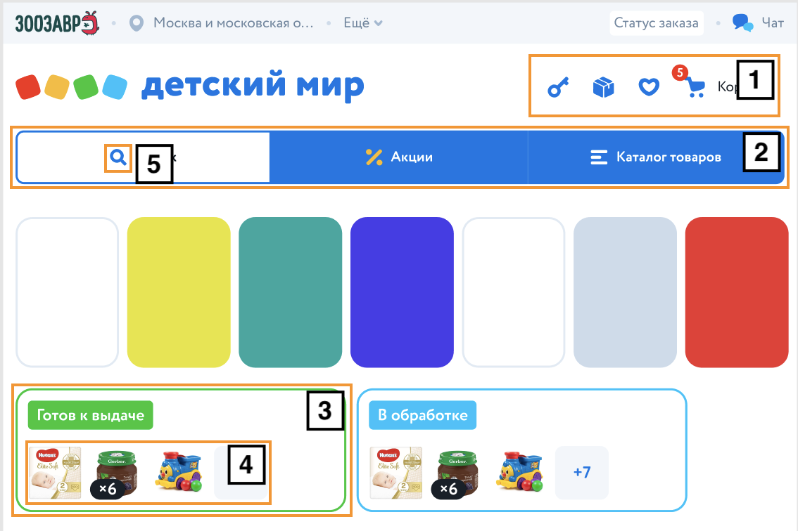
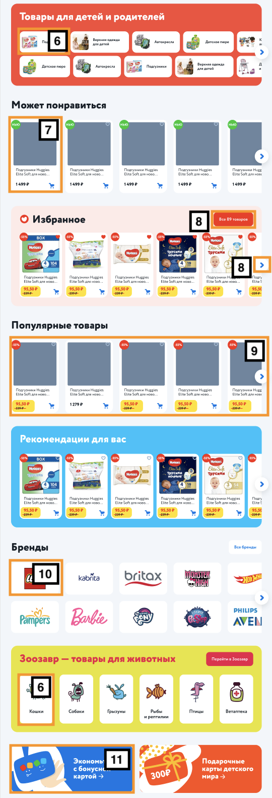

== Лейаут

Описание основных блоков главной страницы

=== Хедер (1)

Шапка сайта

Блок включает в себя контейнеры для дополнительной навигации, для логотипа и контролов и для меню

image::img/header.png[width=400, link='img/header.png']

=== Сторис (2)

Блок, содержащий превью истории

Превью истории - картинка, информирующая о ее содержании

=== Заказы (3)

Блок, содержащий текущие заказы пользователя

=== Ссылки - переименовать (4)

Блок с элементами, указывающими на определенный раздел сайта

=== Акции (5)

Блок с баннерами акций

=== Контейнер - переименовать (6)

Декоративный блок, которому можно задать заголовок/содежимое/фон/кнопку

=== Баннеры (7)

Блок с системными баннерами

==== Схема

image::img/main_1.png[width=300, link='img/main_1.png']
image::img/main_2.png[width=300, link='img/main_2.png']

=== Футер (8)

Подвал сайта

Включает в себя контейнеры для социальных сетей, навигационных ссылок и дополнительной информации

image::img/footer.png[width=400, link='img/footer.png']

== Элементы

Основные элементы сайта

=== Панель пользователя (1)

Блок с пользовательскими элементами управления

=== Меню (2)

Основное меню сайта, группа ссылок, упрощающих навигацию по каталогу сайта

=== Карточка заказа (3)

Краткая информация о заказе

=== Список товаров (4)

Блок с краткой информацией о перечне товаров

=== Иконка (5)

Маленькая, часто встречающаяся картинка (SVG)

=== Карточка категории (6)

Блок с краткой информацией о категории

=== Карточка товара (7)

Блок с краткой информацией о товарe

=== Кнопка (8)

Элемент взаимодействия с пользователем

=== Карусель (9)

Блок прокручивающий какое-либо содержимое

=== Карточка бренда (10)

Блок с краткой информацией о бренде

=== Баннер (11)

Элемент содержащий информацию рекламного харакетера
