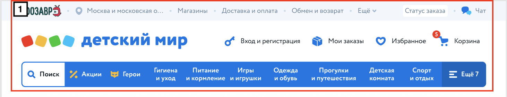
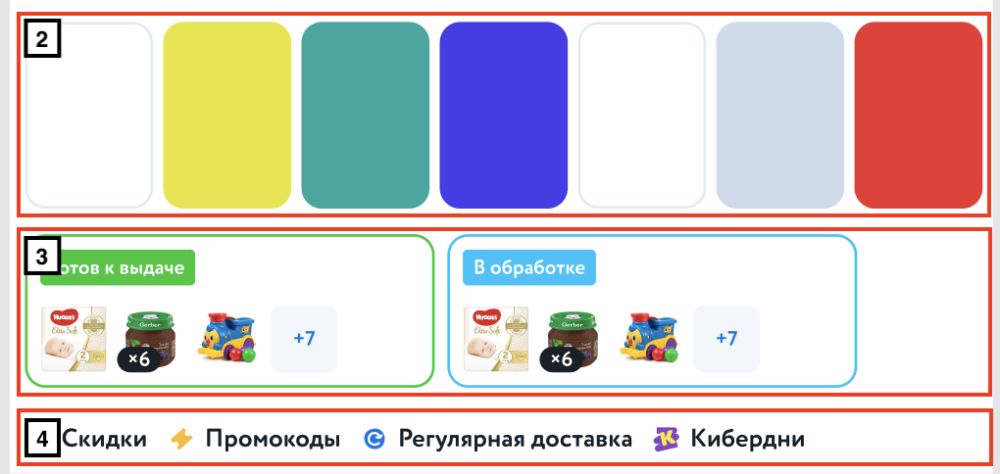
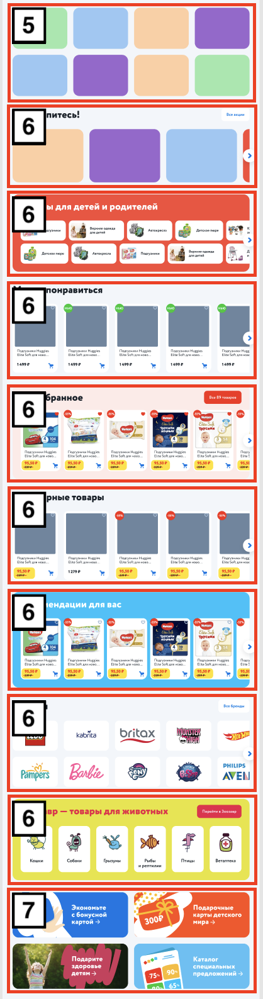
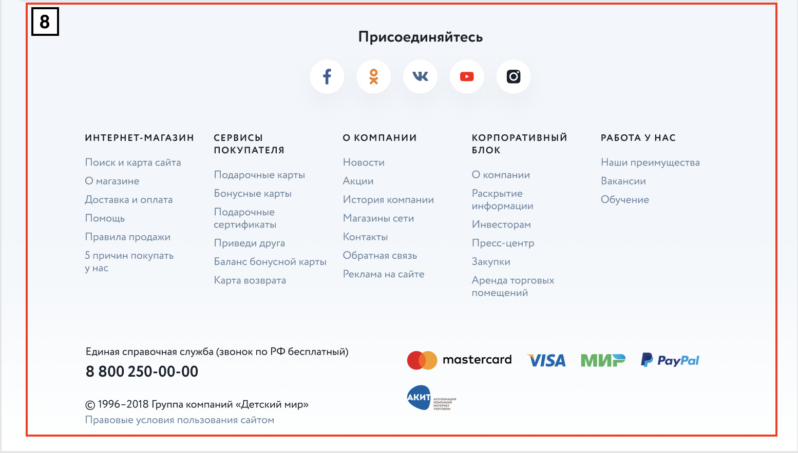

== Лейаут

Описание основных блоков главной страницы

=== Хедер (1)

Шапка сайта

Блок включает в себя контейнеры для дополнительной навигации, для логотипа и контролов и для меню

=== Сторис (2)

Блок, содержащий превью истории

Превью истории - картинка, информирующая о ее содержании

=== Заказы (3)

Блок, содержащий текущие заказы пользователя

=== Ссылки - переименовать (4)

Блок с элементами, указывающими на определенный раздел сайта

=== Акции (5)

Блок с баннерами акций

=== Контейнер - переименовать (6)

Декоративный блок, которому можно задать заголовок/содежимое/фон/кнопку

=== Баннеры (7)

Блок с системными баннерами

==== Схема

=== Футер (8)

Подвал сайта

Включает в себя контейнеры для социальных сетей, навигационных ссылок и дополнительной информации

== Элементы

Основные элементы сайта

=== Меню

Основное меню сайта, группа ссылок, упрощающих навигацию по каталогу сайта

=== Панель пользователя

Блок с пользовательскими элементами управления

=== Карусель

Блок прокручивающий какое-либо содержимое

=== Кнопка

Элемент взаимодействия с пользователем

=== Иконка

Маленькая, часто встречающаяся картинка (SVG)

=== Баннер

Элемент содержащий информацию рекламного харакетера

=== Карточка заказа

Краткая информация о заказе

=== Карточка товара

Блок с краткой информацией о товарe

=== Карточка категории

Блок с краткой информацией о категории

=== Карточка бренда

Блок с краткой информацией о бренде

=== Список товаров

Блок с краткой информацией о товарах в заказе
